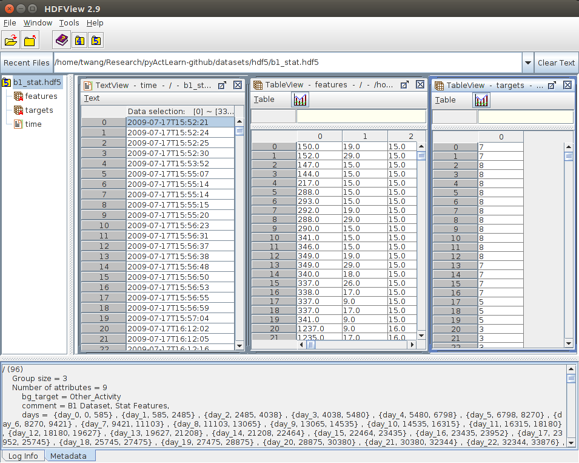

.. casas_hdf5_doc_master:

CASAS.h5py
==========

:ref:`casas_hdf5_doc_master` implements :class:`pyActLearn.CASAS.h5py.CASASHDF5`.

Dataset Structure
-----------------

HDF5_ is a data model, library and file format for storing and managing data.
h5py_ package is the python interface to read and write HDF5_ file.
You can open and view the HDF5_ file using hdfviewer_.

The pre-processed feature array ``x`` is stored as dataset ``/features``.
Corresponding target labels is stored as dataset ``/targets``.
The corresponding time for each entry is stored at ``/time`` as array of bytes (HDF5_ does not support :obj:`str`).

The meta-data of the smart home is stored as attributes of the root node.
The table below summarizes the description of all those attributes.

============  ============
Attribute     Description
============  ============
bg_target     Name of background activity.
comment       Description of the dataset.
days          List of start and stop index tuple of each segment when the dataset is splitted by days.
weeks         List of start and stop index tuple of each segment when the dataset is splitted by weeks.
features      Feature name corresponding to each column in ``/features`` dataset.
targets       List of activity labels.
target_color  List of color string for each activity for visualization.
sources       List of dataset names in the file.
sensors       List of sensor names
============  ============

The image below gives a glimpse of the hdf5 structure in hdfviewer.

   Smart home pre-processed data in hdf5 format.

.. _HDF5: https://support.hdfgroup.org/HDF5/
.. _h5py: http://www.h5py.org/
.. _hdfviewer: https://support.hdfgroup.org/products/java/hdfview/

Load and Fetch Data from HDF5
-----------------------------

:class:`pyActLearn.CASAS.h5py.CASASHDF5` provides multiple interfaces for accessing and loading the data
from hdf5 file. The dataset is usually split by weeks and days. Function
:meth:`pyActLearn.CASAS.h5py.CASASHDF5.fetch_data` will load the time, features and target labels of the
time frame provided via the start split and end split names.

Here is the code snip to load the data from splits to train a support vector machine.

.. code-block:: python

   import sklearn.svm
   from pyActLearn.CASAS.h5py import CASASHDF5
   # Load dataset
   ds = CASASHDF5(path='twor_statNormPerSensor.hdf5')
   # Training
   time, feature, target = ds.fetch_data(start_split='week_1', stop_split='week_4')
   x = feature
   y = target.flatten().astype(np.int)
   model = sklearn.svm.SVC(kernel='rbf')
   model.fit(x, y)
   # Testing
   time, feature, target = ds.fetch_data(start_split='week_1', stop_split='week_4')
   x = feature
   y = model.predict(x)

API Reference
-------------

.. automodule:: pyActLearn.CASAS.h5py
   :members:
   :show-inheritance: